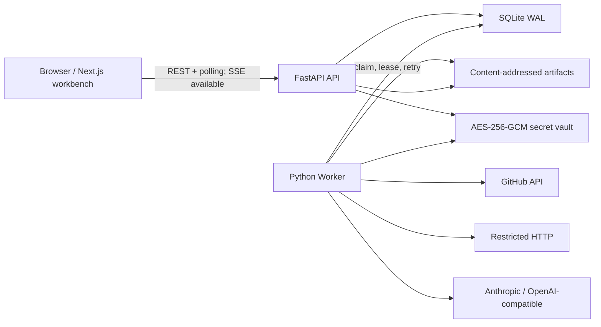

# SourcedGrid 项目完整交接文档

> 新机器或新的 Codex 对话请优先读取本文件。它集中记录产品定义、技术架构、已实现范围、真实缺口、环境恢复方式和后续开发顺序。

最后核对日期：2026-08-11  
当前分支：`main`  
实现基线提交：`7be2870 feat: bootstrap SourcedGrid MVP`  
许可证：Apache-2.0  
代码仓库边界：本仓库只包含 SourcedGrid；不要与同级的 `agent-firewall` 目录共用代码、依赖、数据库或提交历史。

## 1. 一句话定位

SourcedGrid 是一个本地优先、带证据链的 Agentic Spreadsheet：把每一行当作一个研究对象，把每一列当作可重复执行的数据抓取、确定性转换或 LLM 研究步骤，并为每个结果保存来源、原始数据哈希、模型、提示词、成本与执行时间。

英文副标题：

> Open-source agentic spreadsheet for sourced, repeatable research.

首发场景是 `GitHub Repository Radar`：批量比较 GitHub 项目的热度、活跃度、维护健康度、产品定位和采用风险，同时允许用户展开任意生成单元格查看证据。

## 2. 产品原则和明确非目标

核心原则：

- Local-first：单机运行，SQLite 和 Artifact 都保存在本地。
- Source-backed：生成结论必须能追溯到来源 URL 和原始 Artifact。
- Repeatable：相同输入与配置具有稳定缓存指纹，任务可暂停、恢复和重试。
- Failure isolation：单个 Repository 或单元格失败不能拖垮整次研究。
- Secret-safe：API、日志、浏览器状态和导出不得返回明文密钥。
- Open source：Apache-2.0，提供 Docker Compose、CI、贡献与安全文档。

v0.1 明确不做：

- 多人协作、权限系统或云端账号。
- 完整 Excel 兼容。
- 任意浏览器自动化。
- CRM、定时爬虫、插件市场或移动 App。
- 把本地单用户模式包装成多租户安全边界。

## 3. 当前实现状态

### 3.1 已完成

前端：

- Next.js 16、React 19、TypeScript 和 `react-data-grid` 工作台。
- Repository Radar 表格、运行状态、预算显示和单元格证据面板。
- Repository 文本导入；当前支持逐行、逗号分隔、GitHub URL 和 `owner/repo`。
- 启动、暂停、恢复、取消和失败重试操作。
- CSV/JSON 导出入口。
- GitHub Token 与 Anthropic Key 的本地加密设置界面。
- API 不在线时自动进入交互 Demo，不会伪装成真实执行结果。
- 响应式视觉、品牌 favicon 和 `public/og.png` 社交预览图。

后端与 Worker：

- FastAPI REST API 和 OpenAPI 文档。
- SQLAlchemy 数据模型、Alembic 初始迁移、SQLite WAL。
- 独立 Python Worker、SQLite 任务表、租约、指数退避与过期租约回收。
- Column DAG 验证：拒绝重复字段、缺失依赖、自依赖和循环依赖。
- Run 的暂停、恢复、取消、失败重试、预算和任务状态聚合。
- 基于稳定指纹的 Cell 级缓存。
- 内容寻址 Artifact 存储：使用 SHA-256 路径和数据库记录。
- Provenance：来源 URL、Artifact hash、input hash、Connector、模型、Prompt、Tokens、费用、耗时和 cache hit。
- SSE 运行事件接口。
- 模板 YAML 的导入、导出和创建 Grid。
- CSV 值导出与包含完整 receipts 的 JSON 导出。

Connector：

- `github`：Repository metadata、README、Release、语言、Issue 与 PR 快照。
- `http`：只允许 HTTP(S)，拒绝凭证 URL、loopback、private、link-local 和非 global IP，禁止重定向并限制响应体大小。
- `transform`：路径选取、Repository 标准化、主要语言、Release、活跃度和确定性健康分数。
- `llm`：Anthropic 与 OpenAI-compatible Chat Completions；要求返回带 `value` 字段的 JSON。
- LLM Prompt 把上游内容放在不可信 `<sources>` 边界中，明确禁止把研究内容当作指令。

安全与工程化：

- AES-256-GCM 本地密钥库；主密钥首次启动生成并设为 `0600`。
- Secrets API 只返回是否已配置，不返回明文。
- Docker Compose：`web`、`api`、`worker` 三服务共享持久化数据卷。
- Next.js standalone production build。
- GitHub Actions CI、Apache-2.0、`CONTRIBUTING.md` 和 `SECURITY.md`。

### 3.2 已验证结果

在 2026-08-11 的实现机器上已验证：

- `ruff check backend` 通过。
- `pytest backend/tests`：13 tests passed。
- `npm run lint` 通过。
- `npm run build` 通过；Next.js production build 和 TypeScript 检查成功。
- `npm run test:e2e`：2/2 Playwright 流程通过。
- 全新 Alembic 数据库迁移成功，共创建 11 张表。
- API health、3 行 × 12 列的种子 Grid 和 standalone SSR 已通过 smoke test。
- OG URL 会根据请求 Host 动态生成，standalone runtime 能正确提供 `og.png`。
- 一次真实 Repository Radar 运行中，27 个不依赖 LLM 密钥的任务成功；6 个 LLM 或其下游任务因未配置 Anthropic Key 被隔离为失败，Run 正确结束为 `completed_with_errors`。

已知的非阻塞提示：FastAPI TestClient 当前会显示一条 Starlette 关于 `httpx2` 的弃用提示，不影响测试结果。

### 3.3 尚未完成或需要继续加固

这些不是隐藏问题，而是当前 MVP 与可公开推广版本之间的真实差距。

P0：换机器后优先完成

- 当前仓库没有配置 Git remote；必须先推到远端或完整复制目录，否则新机器无法可靠获取 Git 历史。
- 当前机器没有 Docker CLI，因此尚未真正执行 `docker compose build/up`。Compose 结构和 standalone 内容已静态验证，但仍要在装有 Docker 的机器进行一次完整容器验收。
- 尚未使用真实 Anthropic/OpenAI-compatible 密钥跑通完整两列 LLM 结果。
- 尚未使用真实 GitHub Token 验证高频研究、Rate Limit 重置和私有 Repository 行为。
- 当前本地 `data/` 不在 Git 中；如需保留已有数据库、Artifact 和密钥，必须单独安全迁移。

P1：产品完整性与可靠性

- 前端目前通过轮询更新 Run；后端虽然已有 SSE，前端尚未切换到 SSE/EventSource。
- 前端还没有完整的 Grid/Column CRUD、DAG 编辑器、模板导入导出界面和单元格直接编辑。
- 当前“CSV 导入”是文本框按换行或逗号拆分；尚未提供真正的 CSV 文件上传、表头映射、预览和错误行报告。
- 后端支持 OpenAI-compatible Provider，但设置界面目前只显示 GitHub Token 和 Anthropic Key；需要增加 OpenAI Key、Base URL、模型和 Provider 选择。
- LLM `output_schema` 已进入模型和模板，但 Connector 目前只强制 `{ "value": ... }`，尚未按任意 JSON Schema 做完整验证。
- 并发 LLM 任务在读取预算后分别执行，极端情况下可能小幅超预算；需要原子预算预留或单独的预算 ledger。
- 长任务没有续租 heartbeat；当前租约为 90 秒，超过租期的慢请求可能被另一 Worker 重新领取。
- GitHub Rate Limit 仅做错误分类，尚未根据 reset 时间智能延迟任务。
- HTTP Connector 在请求前解析并校验 DNS，但 HTTP 客户端会再次解析；如需更强 SSRF 防护，应固定已验证地址或加入防 DNS rebinding 方案。
- 需要补齐真实并发下的幂等性、取消竞态、缓存失效和数据库锁竞争测试。
- 需要完成 100 个 Repository 的压力验收，以及“Docker 启动到首个结果低于 10 分钟”的计时验收。

P2：开源发布与增长

- 录制 30–60 秒演示 GIF/视频，并补充 README 截图。
- 建立 GitHub Issue/PR 模板、Good First Issue、Roadmap 和 Changelog。
- 配置仓库 Topics、Description、Social Preview、Discussions 和私有漏洞报告。
- 发布 `v0.1.0`，提供预构建 Docker image 和校验值。
- 增加第二个高价值模板，证明框架不是只适用于 GitHub Radar。
- 建立公开 benchmark：研究 100 个 Repository 的时间、缓存命中率、失败隔离与成本。

## 4. 系统架构



Docker Compose 中：

- `web` 暴露 `3000`。
- `api` 暴露 `8000`，启动前执行 Alembic migration。
- `worker` 不对外暴露端口。
- `api` 和 `worker` 共享 `sourcedgrid_data:/data`。
- 浏览器通过 `NEXT_PUBLIC_API_URL` 访问 API。

## 5. 核心数据模型和执行流程

主要关系：

```text
Grid
├── ColumnDefinition[]
└── GridRow[]
    └── Cell[]
        └── Provenance
            └── Artifact

Run
└── RunTask[]

Template
EncryptedSecret
```

一次 Run 的流程：

1. API 校验 Grid 的字段 DAG。
2. 为每一行的每个非 `input` 字段建立 `RunTask`。
3. Worker 按依赖完成情况领取任务，并写入 Worker ID 和 lease expiry。
4. Connector 根据当前行上游 Cell 产生统一 `CellResult`。
5. 原始响应写入内容寻址 Artifact；计算结果和 Provenance 原子写回。
6. 可重试错误进入指数退避；不可重试错误只影响当前 Cell 和依赖它的下游任务。
7. Run 汇总为 `completed`、`completed_with_errors`、`cancelled` 等状态。
8. 后续相同指纹可直接复用缓存，并在 Provenance 中标记 `cache_hit`。

## 6. 旗舰模板

模板文件：`templates/github-repository-radar.yaml`

格式：

```yaml
apiVersion: sourcedgrid/v1alpha1
kind: ResearchTemplate
metadata:
  slug: github-repository-radar
  name: GitHub Repository Radar
  version: 0.1.0
defaults:
  budget_usd: 2.0
columns: []
```

当前 12 个字段：

1. Repository 输入。
2. Canonical name。
3. GitHub snapshot。
4. Stars。
5. Language。
6. License。
7. Last push。
8. Latest release。
9. Issue / PR activity。
10. Deterministic health score。
11. LLM sourced summary。
12. LLM recommendation。

## 7. 主要 API

完整交互文档启动后位于 `http://localhost:8000/docs`。

```text
GET    /health
GET    /v1/grids
POST   /v1/grids
GET    /v1/grids/{grid_id}
POST   /v1/grids/{grid_id}/import
POST   /v1/grids/{grid_id}/columns
PATCH  /v1/grids/{grid_id}/columns/{column_id}
DELETE /v1/grids/{grid_id}/columns/{column_id}

POST   /v1/grids/{grid_id}/runs
GET    /v1/runs/{run_id}
GET    /v1/runs/{run_id}/events
POST   /v1/runs/{run_id}/pause
POST   /v1/runs/{run_id}/resume
POST   /v1/runs/{run_id}/cancel
POST   /v1/runs/{run_id}/retry-failed

GET    /v1/cells/{cell_id}/provenance
GET    /v1/artifacts/{artifact_hash}
GET    /v1/grids/{grid_id}/export?format=csv|json

GET    /v1/templates
GET    /v1/templates/{slug}
POST   /v1/templates
POST   /v1/templates/{slug}/create-grid

GET    /v1/secrets
PUT    /v1/secrets/{name}
```

## 8. 关键目录和文件

```text
app/
  sourced-grid-app.tsx       主要工作台和交互
  api.ts                     浏览器 API client
  sample-data.ts             API 离线时的 Demo 数据
  types.ts                   前端类型
  globals.css                产品视觉系统

backend/app/
  main.py                    FastAPI 路由、种子数据、序列化
  models.py                  SQLAlchemy 数据模型
  schemas.py                 Pydantic API/Connector contracts
  engine.py                  Run 创建、任务领取、租约、重试、缓存
  worker.py                  Worker 进程入口
  template.py                YAML 解析和 DAG 验证
  secrets.py                 AES-GCM 密钥库
  artifacts.py               内容寻址 Artifact 存储
  connectors/                GitHub、HTTP、Transform、LLM

backend/alembic/             数据库 migration
backend/tests/               后端单元与 API 测试
tests/e2e/                   Playwright 浏览器流程
templates/                   版本化研究模板
public/og.png                GitHub/Social Preview
docker-compose.yml           本地三服务部署
Dockerfile.web               Next.js standalone image
Dockerfile.engine            API/Worker 共用 Python image
.github/workflows/ci.yml     CI
```

运行时文件位于 `data/`，已被 `.gitignore` 排除：

```text
data/
  sourcedgrid.db
  sourcedgrid.db-wal
  sourcedgrid.db-shm
  master.key
  artifacts/
```

## 9. 换机器前：先把项目可靠转移出去

### 9.1 首选：配置 Git 远端

当前仓库没有 remote。在旧机器的项目目录执行：

```bash
git status
git log --oneline -5
git remote add origin <你的 GitHub/GitLab 仓库 URL>
git push -u origin main
```

如果远端已由其他方式配置，先运行 `git remote -v`，不要重复添加。

新机器执行：

```bash
git clone <你的仓库 URL> sourced-grid
cd sourced-grid
git switch main
git log -1 --oneline
```

### 9.2 备选：通过 iCloud 或磁盘复制

复制整个 `sourced-grid`，包括隐藏的 `.git`。复制前先停止 Web、API 和 Worker，等待 SQLite WAL 写入结束以及 iCloud 同步完成。

不要复制 `node_modules`、`.venv` 或 `.next`；它们应在新机器重建。若通过 iCloud 自动同步，抵达新机器后先运行：

```bash
git status
git fsck
git log -1 --oneline
```

长期开发仍建议使用 Git remote，而不是把 iCloud 当作唯一版本历史。

### 9.3 是否迁移本地数据

只继续开发代码时，不需要迁移 `data/`，新机器会建立干净数据库和新的主密钥。

需要保留当前研究结果和 Secrets 时，必须在所有服务停止后整体复制 `data/`。数据库和 `master.key` 必须一起迁移；只有数据库而没有原主密钥时，现有加密 Secrets 无法解密。

`data/` 包含敏感凭证与研究内容，不要提交到 Git、公开网盘或 Issue。

## 10. 新机器启动方式

建议环境：

- Git。
- Node.js `>=22.13.0`，优先使用当前 Node 22 LTS 或兼容的 Node 24。
- npm。
- Python 3.12。
- 可选：Docker Desktop 或 Docker Engine + Compose。
- Playwright E2E 需要本机 Chrome，或执行 Playwright 浏览器安装命令。

### 10.1 Docker 启动

这是用户最简单的启动方式，也是换机器后必须补做的 P0 验收：

```bash
docker compose up --build
```

打开：

- Web：`http://localhost:3000`
- API Docs：`http://localhost:8000/docs`

停止但保留数据：

```bash
docker compose down
```

不要运行 `docker compose down -v`，除非明确要删除持久化数据库、Artifact 和加密密钥。

### 10.2 原生开发启动

在仓库根目录执行一次：

```bash
npm ci
python3.12 -m venv .venv
.venv/bin/pip install -e './backend[dev]'
cp .env.example .env
SOURCEDGRID_DATA_DIR=./data .venv/bin/alembic upgrade head
```

然后开启三个终端。

终端 1：

```bash
npm run dev
```

终端 2：

```bash
SOURCEDGRID_DATA_DIR=./data .venv/bin/uvicorn --app-dir backend app.main:app --reload --port 8000
```

终端 3：

```bash
cd backend
SOURCEDGRID_DATA_DIR=../data ../.venv/bin/python -m app.worker
```

也可以使用 `Makefile` 中的 `dev-web`、`dev-api` 和 `dev-worker`。

首次启动会建立 Repository Radar 模板，并加入三个公开 Repository。未配置 API Key 时，确定性字段仍应成功，LLM 字段会明确失败而不会阻塞其他行。

## 11. Credentials 和环境变量

`.env.example` 当前包含：

```dotenv
NEXT_PUBLIC_API_URL=http://localhost:8000
SOURCEDGRID_DATA_DIR=./data
SOURCEDGRID_CORS_ORIGINS=http://localhost:3000,http://127.0.0.1:3000
SOURCEDGRID_WORKER_CONCURRENCY=5
SOURCEDGRID_MAX_HTTP_BYTES=2000000
```

建议从 Web 的 Settings 界面保存：

- `github_token`
- `anthropic_api_key`

后端也识别 `openai_api_key`，但前端尚未提供对应输入框。

不要把 Provider Key 直接写入 `.env`、模板、日志、测试 fixture 或导出文件。当前产品预期它们通过 Secrets API 加密保存在 SQLite 中。

## 12. 每次接手后的验证清单

先确认工作树和版本：

```bash
git status
git log -1 --oneline
```

后端：

```bash
.venv/bin/ruff check backend
.venv/bin/pytest backend/tests
```

前端：

```bash
npm run lint
npm run build
```

浏览器：

```bash
npm run test:e2e
```

若 Chrome 不可用：

```bash
npx playwright install chrome
```

容器机器额外执行：

```bash
docker compose config
docker compose build
docker compose up
```

手动验收顺序：

1. 打开 Web，确认显示 `Local engine` 而不是 `Demo data`。
2. 导入一个新的公开 Repository。
3. 启动研究并观察各行独立完成。
4. 打开一个生成 Cell，检查来源、Artifact hash、Prompt、成本和耗时。
5. 暂停、恢复和重试失败任务。
6. 导出 CSV 和带 receipts 的 JSON。
7. 搜索 API 响应、浏览器状态和日志，确认没有明文 Token。
8. 重启 Worker，确认未完成任务能继续执行。

## 13. 建议的下一阶段执行顺序

严格按以下顺序推进，可以最快把 MVP 变成适合公开发布的版本。

### Milestone A：可迁移、可运行

- [ ] 配置 Git remote 并推送 `main`。
- [ ] 在新机器从 remote clone，而不是依赖已有 `node_modules` 或 `.venv`。
- [ ] 运行全部测试。
- [ ] 真正执行 Docker Compose build/up。
- [ ] 使用 GitHub Token 完成至少 10 个 Repository 的真实运行。
- [ ] 分别使用 Anthropic 和 OpenAI-compatible Provider 完成一轮完整运行。
- [ ] 检查 API、浏览器、日志和导出中不存在明文密钥。

### Milestone B：补齐核心产品交互

- [ ] 前端使用 SSE 替代 Run 轮询。
- [ ] 实现 Grid、Row、Column 的完整 CRUD。
- [ ] 实现可视化 Column DAG 与循环错误提示。
- [ ] 实现 CSV 文件上传、字段映射、预览和错误报告。
- [ ] 实现模板导入、导出和新建 Grid 的完整 UI。
- [ ] 实现 Provider、模型、Base URL 与预算设置。
- [ ] 根据 `output_schema` 校验 LLM 结构化输出。

### Milestone C：可靠性和安全加固

- [ ] 长任务 lease heartbeat。
- [ ] 原子预算预留，消除并发超预算。
- [ ] GitHub Rate Limit reset-aware 调度。
- [ ] HTTP DNS rebinding 防护。
- [ ] 100 Repository 压力、重启恢复和并发幂等测试。
- [ ] Docker 首次结果低于 10 分钟的正式验收。
- [ ] 日志统一脱敏和安全回归测试。

### Milestone D：开源发布

- [ ] README 截图和演示 GIF。
- [ ] Issue/PR 模板与 Roadmap。
- [ ] GitHub Topics、Social Preview 和 Discussions。
- [ ] 发布 `v0.1.0` 和 Docker image。
- [ ] 建立公开 benchmark 与第二个旗舰模板。

## 14. 给下一位开发者或 Agent 的起始提示

可以把下面内容直接作为新对话的第一条指令：

```text
请先完整阅读 PROJECT_HANDOFF.md 和 README.md，再检查 git status、最近提交和测试状态。
这是 SourcedGrid：本地优先、带证据链的 Agentic Spreadsheet。
不要修改同级 agent-firewall 项目，也不要提交 data/、master.key、数据库、Artifact、.env、node_modules 或 .venv。
从 PROJECT_HANDOFF.md 的“建议的下一阶段执行顺序”继续；执行前先复现现有测试，完成后更新该文档中的状态和缺口。
```

## 15. 完成定义

下一个可公开发布版本至少满足：

- Docker 一条命令启动 Web、API、Worker。
- 新用户 10 分钟内得到第一个真实研究结果。
- 100 个 Repository 中单行失败不影响其他行，服务重启后可继续。
- GitHub、HTTP、Transform、Anthropic 和 OpenAI-compatible 均有通过的真实或合同测试。
- 每个生成结果都能查看来源和执行 receipt。
- 密钥不出现在 API、日志、浏览器状态或导出中。
- 缓存、预算、租约和重试在并发下保持一致。
- README、演示素材、贡献指南、安全策略和 release artifacts 齐全。

完成任何里程碑后，请同步更新本文件顶部日期、当前状态、验证结果与剩余缺口，使它继续成为项目唯一的开发交接入口。
