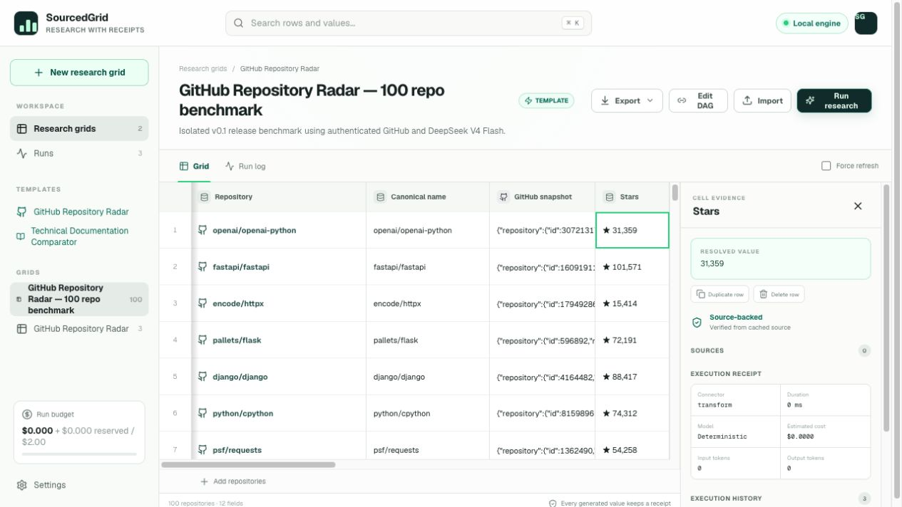
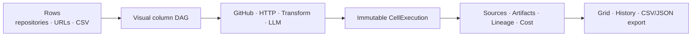
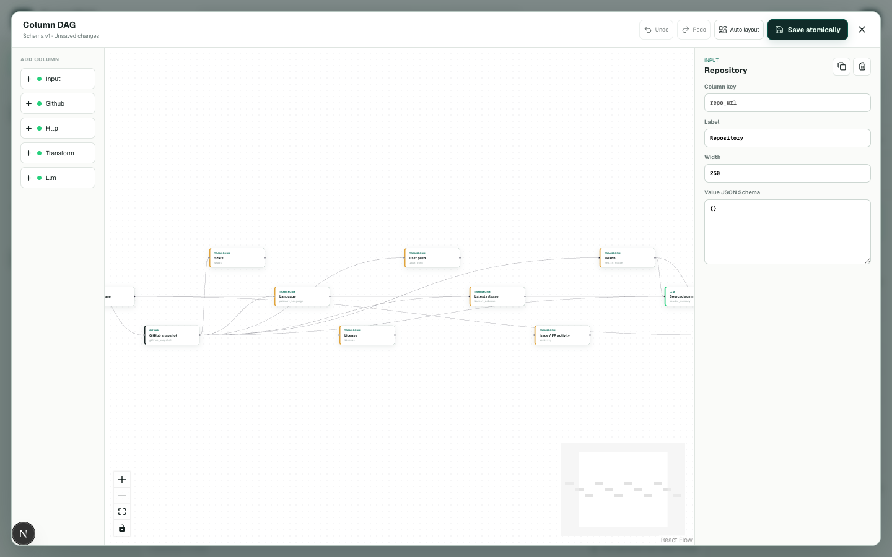

# SourcedGrid

<p align="center">
  <a href="./README.md"><strong>English</strong></a> · <a href="./README.zh-CN.md">简体中文</a>
</p>

<p align="center"><strong>Local-first AI research grids with an evidence trail.</strong></p>

<p align="center">
  Turn repositories, technical documentation, and structured inputs into repeatable research.<br />
  Every generated result stays connected to the source, exact execution, upstream lineage, cache decision, model receipt, and estimated cost.
</p>

<p align="center">
  <a href="https://github.com/YuYigeng/sourced-grid/actions/workflows/ci.yml"></a>
  <a href="https://github.com/YuYigeng/sourced-grid/releases"></a>
  <a href="./LICENSE"></a>
  
</p>



<p align="center">
  <a href="docs/assets/sourced-grid-demo.mp4">Watch the 50-second product walkthrough</a> ·
  <a href="https://github.com/YuYigeng/sourced-grid/releases/tag/v0.1.0-rc.1">View the v0.1.0-rc.1 release</a>
</p>

## Research with receipts, not black-box answers

Most AI research tools end with prose that is difficult to audit or reproduce. SourcedGrid treats research as a durable data workflow.

| Typical AI research | SourcedGrid |
| --- | --- |
| One conversation produces one answer | A row-and-column DAG produces comparable results |
| Sources are loosely attached to prose | Every generated cell has an immutable Execution and Provenance receipt |
| Rerunning can silently replace history | Every Run remains independently inspectable and exportable |
| A template may control where credentials go | Templates reference local Provider slots and never carry credentials or endpoints |
| Cache behavior is invisible | Cache fingerprints, TTLs, reuse origin, and Force Refresh are explicit |

## How it works



Define each research step as a column, connect dependencies visually, and run the same workflow across every row. Deterministic connectors do the work they can; an LLM is optional and used only for columns that need interpretation.

## Built for

- Comparing open-source repositories before adoption or investment.
- Reviewing developer products and technical documentation at scale.
- Building repeatable technology landscapes and vendor comparisons.
- Research where every conclusion must be traceable to raw evidence.
- Local workflows that need model choice without handing trust to imported templates.

## What is included

| Area | Capabilities |
| --- | --- |
| Workbench | Grid and row management, mapped CSV import, visual DAG editing, undo/redo, Run controls, live replayable logs |
| Connectors | Input, GitHub, DNS-pinned HTTP, deterministic Transform, and LLM columns |
| Evidence | Immutable execution history, exact upstream lineage, source URLs, content-addressed Artifacts, run-scoped export |
| Reliability | SQLite WAL queue, Worker leases and heartbeat, crash recovery, cancellation protection, atomic budget reservation |
| Caching | Versioned fingerprints, connector-specific TTLs, conditional GitHub requests, explicit Force Refresh |
| Security | Local encrypted vault, trusted Provider Profiles, credential redaction, SSRF protection, hardened Artifact downloads |



## LLM providers

SourcedGrid keeps Provider configuration local. Imported templates can select a `provider_ref`, but they cannot include a Base URL, secret name, or credential destination.

| Category | Built-in profiles |
| --- | --- |
| China | DeepSeek, Alibaba Cloud Qwen, Zhipu GLM, MiniMax, SiliconFlow |
| International | Anthropic, OpenAI |
| Local | Ollama without credentials |
| Custom | User-trusted OpenAI-compatible HTTPS endpoints |

Provider profiles support model selection, temperature, structured-output compatibility mode, and editable pricing snapshots. LLM output must use a strict `{ "value": ... }` envelope and pass local JSON Schema validation.

## Quick start

Requirements: Docker Desktop or Docker Engine with Compose.

```bash
git clone https://github.com/YuYigeng/sourced-grid.git
cd sourced-grid
docker compose up --build
```

Open the workbench at [http://localhost:3000](http://localhost:3000) and the API documentation at [http://localhost:8000/docs](http://localhost:8000/docs).

The first Grid contains three public repositories. Deterministic GitHub research works without an LLM key. Add a GitHub token and an optional model in **Settings → Credentials & LLM providers**, then select that Provider in the relevant LLM nodes. Secrets are encrypted inside the local Docker data volume and plaintext values are never returned by the API.

> SourcedGrid is local-first, not offline-only. GitHub, HTTP, and hosted LLM columns make outbound requests when a Run requires them.

## Included research templates

### GitHub Repository Radar

Compare repository metadata, languages, licensing, releases, recent activity samples, README positioning, deterministic health components, and LLM-assisted adoption risk.

### Technical Documentation Comparator

Capture raw documentation HTML, deterministically extract main text and metadata, and compare audience, capabilities, integration complexity, and risks while retaining the upstream HTTP Artifact.

Templates use a versioned YAML contract and are rejected if they contain duplicate keys, missing dependencies, cycles, provider URLs, or secret names. See [`templates/`](templates/).

## Trust and recovery

- Each Run creates new `CellExecution` records instead of overwriting old results.
- `ExecutionDependency` records the exact upstream executions used by a result.
- GitHub and HTTP use short-lived caches; LLM reuse requires matching input, model, prompt, schema, and Provider configuration.
- HTTP requests pin validated public DNS answers, disable redirects, and stream into a strict response-size limit.
- Credentials are encrypted with AES-256-GCM using a locally generated, permission-restricted master key.
- Database migrations create a consistent SQLite backup before changing the schema and stop safely if migration fails.

Read the full [architecture and trust-boundary guide](docs/architecture.md).

## Current status

`v0.1.0-rc.1` is the first public release candidate. The protected `main` branch passes backend tests, production Web build, browser E2E, migration checks, and Docker smoke tests. The release publishes public multi-architecture GHCR images, provenance, digests, checksums, and an SPDX SBOM.

Live hosted-provider acceptance currently covers GitHub + DeepSeek. Anthropic is implemented and covered by connector, schema, and redaction tests, but has not been exercised against a live Anthropic account.

SourcedGrid v0.1 is a local single-user application. Authentication, multi-tenancy, hosted SaaS, mobile clients, arbitrary browser automation, and a plugin marketplace are intentionally out of scope.

See the [RC acceptance record](docs/rc-acceptance-2026-08-14.md), [roadmap](ROADMAP.md), and [changelog](CHANGELOG.md).

## Local development

Requirements: Node.js 22.13+, Python 3.12+, npm, and `uv`.

```bash
npm ci
uv sync --project backend --extra dev
cp .env.example .env
```

Run the Web app, API, and Worker in separate terminals:

```bash
npm run dev
SOURCEDGRID_DATA_DIR=./data backend/.venv/bin/uvicorn --app-dir backend app.main:app --reload --port 8000
cd backend && SOURCEDGRID_DATA_DIR=../data .venv/bin/python -m app.worker
```

Before opening a pull request:

```bash
backend/.venv/bin/ruff check backend
backend/.venv/bin/python -m pytest backend/tests
npm run lint
npm run build
npm run test:e2e
```

## Documentation

- [Architecture and trust boundaries](docs/architecture.md)
- [Release checklist](docs/release-checklist.md)
- [Contributing guide](CONTRIBUTING.md)
- [Security policy](SECURITY.md)
- [Maintainer handoff](PROJECT_HANDOFF.md)

## License

Apache License 2.0. See [`LICENSE`](LICENSE).
