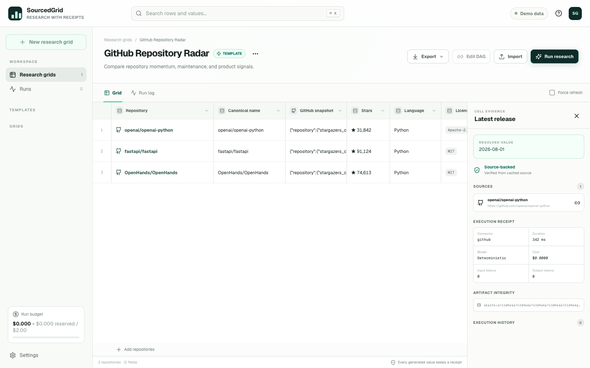

# SourcedGrid

> Continuing development on another machine or in a new agent session? Start with [`PROJECT_HANDOFF.md`](PROJECT_HANDOFF.md).

**Open-source agentic spreadsheet for sourced, repeatable research.**

SourcedGrid turns a list of repositories into a structured research grid. Each generated cell keeps a receipt: source URLs, raw artifact hash, connector, model, prompt, duration, token use, and estimated cost.




The first included workflow, **GitHub Repository Radar**, compares repository health, activity, licensing, releases, README positioning, and adoption risk without turning research into an untraceable chat transcript.

## What works today

- Import mapped CSV files with preview, duplicate policy, and per-row reports.
- Visual, undoable column DAG editor with cycle checks and optimistic schema versions.
- GitHub snapshots covering repository metadata, README, releases, languages, issues, and pull requests.
- Deterministic maintenance score and activity fields that work without an LLM key.
- Anthropic and OpenAI-compatible structured-output connectors.
- Immutable `CellExecution` history and execution-to-execution lineage; old runs remain exportable.
- SQLite WAL queue with heartbeat leases, ownership checks, atomic budget reservation, reset-aware GitHub scheduling, cancellation protection, and crash recovery.
- Content-addressed raw artifacts and source receipts for every successful generated cell.
- Encrypted local credential vault; plaintext keys are never returned by the API.
- Versioned YAML templates, CSV export, and full JSON export with receipts.
- Local trusted Provider Profiles; templates reference slots and can never choose a credential endpoint.
- GitHub Repository Radar and Technical Documentation Comparator templates.
- Local Web UI, FastAPI, persisted replayable SSE run events, and Docker Compose deployment.

## Quick start with Docker

Requirements: Docker Desktop or Docker Engine with Compose.

```bash
docker compose up --build
```

Open [http://localhost:3000](http://localhost:3000). The API documentation is available at [http://localhost:8000/docs](http://localhost:8000/docs).

The app starts with three public repositories. Deterministic GitHub research works without an LLM key. Add a GitHub token and optional provider key in **Settings → Local credentials**. Credentials are encrypted into the Docker data volume.

API and worker containers use Cloudflare's public resolvers by default so VPN fake-IP DNS does not conflict with SSRF validation. If your network requires different trusted resolvers, set `SOURCEDGRID_DNS_PRIMARY` and `SOURCEDGRID_DNS_SECONDARY` before starting Compose.

## Local development

Requirements: Node.js 22.13+, Python 3.12+, and npm.

```bash
npm ci
uv sync --project backend --extra dev
cp .env.example .env
```

Run these in separate terminals:

```bash
npm run dev
SOURCEDGRID_DATA_DIR=./data backend/.venv/bin/uvicorn --app-dir backend app.main:app --reload --port 8000
cd backend && SOURCEDGRID_DATA_DIR=../data .venv/bin/python -m app.worker
```

## Research template format

Templates use a versioned YAML contract:

```yaml
apiVersion: sourcedgrid/v1alpha1
kind: ResearchTemplate
metadata:
  slug: minimal-repository-check
  name: Minimal repository check
  version: 0.1.0
columns:
  - key: repo_url
    label: Repository
    kind: input
  - key: canonical_name
    label: Canonical name
    kind: transform
    depends_on: [repo_url]
    config:
      source: repo_url
      operation: canonical_repository
```

Templates reject missing dependencies, duplicate keys, self-dependencies, cycles, provider URLs, and secret names before they are saved. See [`templates/github-repository-radar.yaml`](templates/github-repository-radar.yaml) and [`templates/technical-documentation-comparator.yaml`](templates/technical-documentation-comparator.yaml).

## API surface

- `GET|PATCH|DELETE /v1/grids/{grid_id}` — read or manage a grid.
- `POST /v1/grids/{grid_id}/rows:import` — mapped bulk import with a row report.
- `POST /v1/grids/{grid_id}/schema/validate` / `PUT .../schema` — validate and atomically save a versioned DAG.
- `POST /v1/grids/{grid_id}/runs` — create a durable research run.
- `GET /v1/grids/{grid_id}/runs` / `GET /v1/runs/{run_id}/results` — immutable history.
- `GET /v1/runs/{run_id}/events` — stream run progress over SSE.
- `POST /v1/runs/{run_id}/pause|resume|cancel|retry-failed` — control a run.
- `GET /v1/cells/{cell_id}/history` — inspect all executions; provenance supports `execution_id`.
- `GET|POST|PATCH|DELETE /v1/providers` — manage locally trusted provider profiles.
- `GET /v1/artifacts/{hash}` — retrieve a content-addressed raw artifact.
- `GET /v1/grids/{grid_id}/export?format=csv|json&run_id=...` — latest view or a run snapshot.
- `GET|POST /v1/templates` — export or import template YAML.

Interactive OpenAPI documentation is served by the local API at `/docs`.

## Security boundaries

- Research content is treated as untrusted data and is wrapped in an explicit prompt-injection boundary before LLM use.
- The HTTP connector pins validated DNS answers into the transport, blocks private/credential-bearing destinations, disables redirects, and streams into a strict size cap.
- Credentialed custom providers require trusted public HTTPS endpoints; credentialless local providers are explicitly supported.
- Provider and GitHub credentials are encrypted with AES-256-GCM using a locally generated `0600` master key.
- API responses, exports, and logs expose only whether a secret is configured.
- Provider costs shown in the UI are estimates; provider invoices remain authoritative.

SourcedGrid is a local single-user application in v0.1. It is not a multi-tenant authorization boundary.

## Testing

```bash
backend/.venv/bin/python -m pytest backend/tests
backend/.venv/bin/ruff check backend
npm run lint
npm run build
npm run test:e2e
```

The suite covers lossless migration, immutable three-run export, cache fingerprints and TTLs, provider trust, strict JSON Schema output, SSRF/DNS pinning, redaction, atomic budgets, cancellation races, lease recovery, the production Web build, and primary browser workflows.

## Releases and roadmap

See [`ROADMAP.md`](ROADMAP.md) and [`CHANGELOG.md`](CHANGELOG.md). Release tags build signed-provenance-ready multi-architecture GHCR images, attach an SPDX SBOM, and publish checksums and image digests.

## Project layout

```text
app/         Next.js workbench
backend/     FastAPI, worker, connectors, models, tests, Alembic
templates/   Versioned research workflows
data/        Ignored local SQLite, artifacts, and master key
```

See [`docs/architecture.md`](docs/architecture.md) for execution lineage, cache, trust boundaries, and migration recovery. Release operators should use [`docs/release-checklist.md`](docs/release-checklist.md).

## Non-goals for v0.1

Multi-user collaboration, Excel fidelity, arbitrary browser automation, CRM features, hosted accounts, scheduled crawling, a third-party plugin marketplace, and mobile apps are intentionally out of scope.

## License

Apache License 2.0. See [`LICENSE`](LICENSE). Contributions are welcome; see [`CONTRIBUTING.md`](CONTRIBUTING.md) and [`SECURITY.md`](SECURITY.md).
