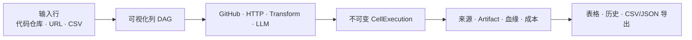

# SourcedGrid

<p align="center">
  <a href="./README.md">English</a> · <a href="./README.zh-CN.md"><strong>简体中文</strong></a>
</p>

<p align="center"><strong>带证据链的本地优先 AI 研究表格。</strong></p>

<p align="center">
  把代码仓库、技术文档和结构化输入批量转成可复现、可审计的研究结果。<br />
  每个生成结果都保留来源、精确执行记录、上游血缘、缓存决策、模型收据和估算成本。
</p>

<p align="center">
  <a href="https://github.com/YuYigeng/sourced-grid/actions/workflows/ci.yml"></a>
  <a href="https://github.com/YuYigeng/sourced-grid/releases"></a>
  <a href="./LICENSE"></a>
  
</p>


<p align="center">
  <a href="docs/assets/sourced-grid-demo.mp4">观看 50 秒产品演示</a> ·
  <a href="https://github.com/YuYigeng/sourced-grid/releases/tag/v0.1.0-rc.1">查看 v0.1.0-rc.1 Release</a>
</p>

## 研究需要收据，而不只是一个答案

普通 AI 研究工具通常只留下一段难以核验、也难以复现的文字。SourcedGrid 把研究过程变成可持久保存的数据工作流。

| 普通 AI 研究 | SourcedGrid |
| --- | --- |
| 一次对话得到一个答案 | 用行与列组成的 DAG 批量生成可比较结果 |
| 来源只是松散地附在文字旁 | 每个生成单元格都有不可变 Execution 和 Provenance 收据 |
| 再次运行可能覆盖旧结果 | 每次 Run 都能独立查看和导出 |
| 模板可能控制密钥发往哪里 | 模板只能引用本地 Provider 槽位，不能携带密钥或地址 |
| 缓存过程不可见 | 缓存指纹、TTL、复用来源和 Force Refresh 都是显式的 |

## 工作方式



把每一步研究定义成一列，在画布上连接依赖，然后让同一套流程运行在每一行数据上。确定性连接器优先完成可以确定计算的部分；只有确实需要理解和归纳的列才调用 LLM。

## 适合这些场景

- 在采用或投资前批量比较开源项目。
- 大规模评估开发者产品、API 和技术文档。
- 建立可重复更新的技术版图和供应商对比。
- 每条结论都必须能回到原始证据的研究任务。
- 需要自由选择模型，同时不允许外部模板控制凭证去向的本地工作流。

## 当前能力

| 模块 | 能力 |
| --- | --- |
| 工作台 | Grid/Row 管理、CSV 表头映射导入、可视化 DAG、撤销/重做、Run 控制、可回放实时日志 |
| 连接器 | Input、GitHub、DNS 固定的 HTTP、确定性 Transform 和 LLM 列 |
| 证据 | 不可变执行历史、精确上游血缘、来源 URL、内容寻址 Artifact、按 Run 导出 |
| 可靠性 | SQLite WAL 队列、Worker lease/heartbeat、崩溃恢复、取消保护、原子预算预留 |
| 缓存 | 版本化指纹、按连接器设置 TTL、GitHub 条件请求、显式 Force Refresh |
| 安全 | 本地加密密钥库、可信 Provider Profile、凭证脱敏、SSRF 防护、Artifact 下载加固 |


## 大模型支持

Provider 配置只保存在本地。导入的模板可以选择 `provider_ref`，但不能携带 Base URL、密钥名或凭证目标地址。

| 类型 | 内置配置 |
| --- | --- |
| 中国模型 | DeepSeek、阿里云通义千问、智谱 GLM、MiniMax、SiliconFlow |
| 国际模型 | Anthropic、OpenAI |
| 本地模型 | 无需凭证的 Ollama |
| 自定义 | 由本地用户确认信任的 OpenAI-compatible HTTPS 地址 |

Provider Profile 支持模型、temperature、结构化输出兼容模式和可编辑价格快照。所有 LLM 输出都必须使用严格的 `{ "value": ... }` 顶层结构，并再次通过本地 JSON Schema 校验。

## 快速开始

需要安装 Docker Desktop，或带 Compose 的 Docker Engine。

```bash
git clone https://github.com/YuYigeng/sourced-grid.git
cd sourced-grid
docker compose up --build
```

打开 [http://localhost:3000](http://localhost:3000) 使用工作台；API 文档位于 [http://localhost:8000/docs](http://localhost:8000/docs)。

首次启动会生成一个包含 3 个公开仓库的 Grid。不配置 LLM 密钥也能运行确定性的 GitHub 研究。在 **Settings → Credentials & LLM providers** 中添加 GitHub Token 和可选模型，然后在对应 LLM 节点中选择该 Provider。密钥会加密保存在本地 Docker 数据卷中，API 永远不会返回明文。

> Local-first 不等于完全离线。只有在 Run 需要时，GitHub、HTTP 和托管 LLM 列才会向对应服务发起网络请求。

## 内置研究模板

### GitHub Repository Radar

比较仓库元数据、语言、许可证、版本发布、近期活跃度样本、README 定位、确定性健康分项，以及由 LLM 辅助判断的采用风险。

### Technical Documentation Comparator

保存原始文档 HTML，用确定性转换提取正文和元数据，再比较目标用户、核心能力、集成复杂度与风险，同时保留上游 HTTP Artifact。

模板遵循版本化 YAML 合同。重复 key、缺失依赖、循环依赖、Provider URL 或密钥名都会在保存前被拒绝。模板位于 [`templates/`](templates/)。

## 可信性与恢复

- 每次 Run 都创建新的 `CellExecution`，不会覆盖旧结果。
- `ExecutionDependency` 记录结果实际使用的精确上游 Execution。
- GitHub 和 HTTP 使用短期缓存；LLM 只有在输入、模型、Prompt、Schema 和 Provider 配置都一致时才会复用。
- HTTP 会固定已经验证的公网 DNS 结果、禁止重定向，并以流式方式限制响应体大小。
- 凭证使用 AES-256-GCM 加密，主密钥仅在本地生成，并使用受限文件权限保存。
- 数据库迁移前会用 SQLite backup API 创建一致性备份；迁移失败会安全停止并输出恢复方式。

详细设计见[架构与信任边界](docs/architecture.md)。

## 当前状态

`v0.1.0-rc.1` 是第一个公开候选版本。受保护的 `main` 分支已经通过后端测试、生产 Web 构建、浏览器 E2E、迁移测试和 Docker smoke。Release 同时提供公开的 amd64/arm64 GHCR 镜像、provenance、digest、checksums 和 SPDX SBOM。

当前真实托管模型验收覆盖 GitHub + DeepSeek。Anthropic 已完成连接器、Schema 和脱敏自动化测试，但尚未使用真实 Anthropic 账号运行。

SourcedGrid v0.1 是本地单用户应用。登录、多租户、托管 SaaS、移动端、任意浏览器自动化和插件市场暂不在范围内。

更多信息见 [RC 验收记录](docs/rc-acceptance-2026-08-14.md)、[路线图](ROADMAP.md)和[更新日志](CHANGELOG.md)。

## 本地开发

需要 Node.js 22.13+、Python 3.12+、npm 和 `uv`。

```bash
npm ci
uv sync --project backend --extra dev
cp .env.example .env
```

分别启动 Web、API 和 Worker：

```bash
npm run dev
SOURCEDGRID_DATA_DIR=./data backend/.venv/bin/uvicorn --app-dir backend app.main:app --reload --port 8000
cd backend && SOURCEDGRID_DATA_DIR=../data .venv/bin/python -m app.worker
```

提交 PR 前运行：

```bash
backend/.venv/bin/ruff check backend
backend/.venv/bin/python -m pytest backend/tests
npm run lint
npm run build
npm run test:e2e
```

## 项目文档

- [架构与信任边界](docs/architecture.md)
- [发布检查清单](docs/release-checklist.md)
- [贡献指南](CONTRIBUTING.md)
- [安全策略](SECURITY.md)
- [维护者交接文档](PROJECT_HANDOFF.md)

## 开源协议

Apache License 2.0，详见 [`LICENSE`](LICENSE)。
