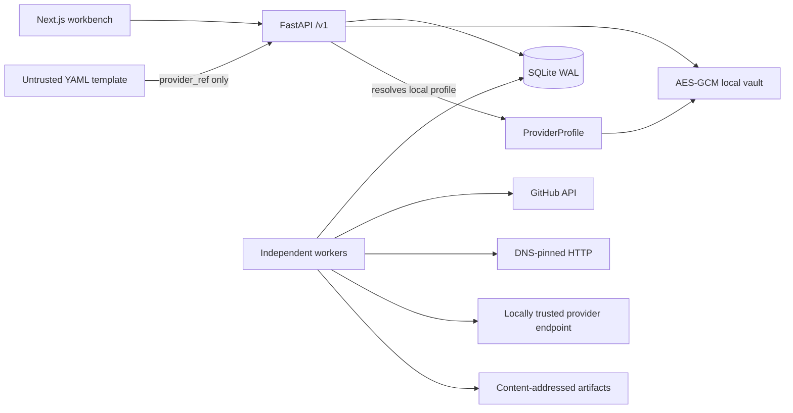

# Architecture and trust boundaries

The API owns schema validation, local provider trust, encrypted credentials, and durable state. Workers claim tasks through leases and write only while they still own the task. Network calls use immutable snapshots and do not keep a database session open.

Each run creates one `CellExecution` per participating cell. `Provenance` belongs to an execution, never directly to a mutable Cell view. `ExecutionDependency` points to the exact upstream executions used, so a repeated run cannot rewrite old lineage. `Cell.latest_execution_id` plus the legacy value/status fields are only a v0.1 projection.

## Cache policy

| Connector | Default lifetime | Fingerprint inputs |
| --- | --- | --- |
| GitHub | 15 minutes | connector version, config, schema, input content, ETag source state |
| HTTP | 15 minutes | connector version, config, schema, input content |
| LLM | 24 hours | provider profile, model, prompt, schema, input content |
| Transform | until input changes | connector version, config, schema, input content |

Credentials are never fingerprint inputs. `force_refresh=true` bypasses every cache and creates a new execution.

## Migration recovery

At startup SourcedGrid checks the Alembic revision. If an upgrade is required, it uses SQLite's backup API to create a consistent copy under `data/backups/` before applying migrations. A failed migration aborts startup and prints the exact restore command.
